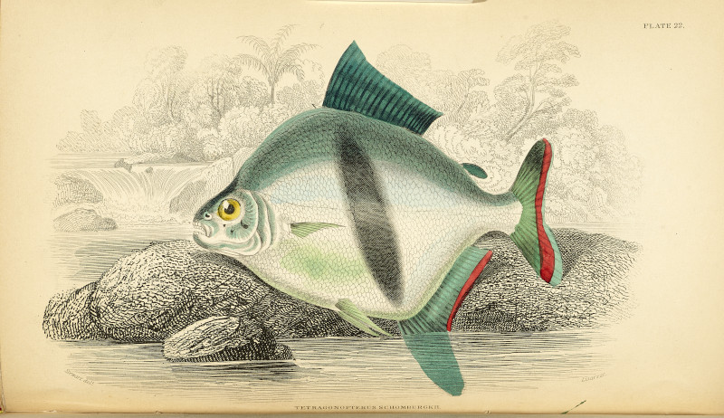

[](https://zenodo.org/badge/latestdoi/327435617)

# Integrative taxonomy of the black-barred disk pacus (Characiformes: Serrasalmidae: _Myloplus_), including the redescription of _Myloplus schomburgkii_ and the description of two new species

Valéria N. Machado, Victória D. Pereira, Rafaela P. Ota, Rupert A. Collins, Marcelo C. Andrade, James R. Garcia-Ayala, Michel Jégu, Izeni P. Farias and Tomas Hrbek.



### Abstract
Presently, _Myloplus schomburgkii_ is the most easily recognized species among the serrasalmids by having a vertical black bar in the middle of the body. However, through a broad taxonomic review, including DNA barcoding and morphological analyses, we were able to identify and describe two new species that also share a dark vertical bar on the flank. In addition, we redescribe _M. schomburgkii_, designating a neotype and restricting the type locality to rio Negro in Barcelos, Amazonas State, Brazil. The three lineages of black-barred pacus present high molecular divergences (7.9–9.7%) and can be distinguished by differences in the shape of the vertical bar, shape of females's anal fin, number of total vertebrae, number of total branched dorsal-fin rays, among other characters. Although the existence of these two new species was obfuscated due to many morphological similarities, mainly the presence of the black bar, the three lineages do not compose a monophyletic group, with one of the new species being recovered as sister to _Ossubtus xinguensis_. This result reinforces the necessity of the redefinition of the Myleini genera.


### Prerequisites

Please install [R](https://cran.r-project.org/) v4.2.1 (use [renv-installer](https://github.com/jcrodriguez1989/renv-installer) to manage local R versions), [MrBayes](https://nbisweden.github.io/MrBayes/download.html) v3.2.7a, [raxml-ng](https://github.com/amkozlov/raxml-ng) v1.2.0, [TreeAnnotator](https://github.com/beast-dev/beast-mcmc) v1.10.4, and [mPTP](https://github.com/Pas-Kapli/mptp) v0.2.5 onto your `$PATH`.

### Run code

```bash
# clone the repository and cd
git clone https://github.com/boopsboops/myloplus-schomburgkii.git
cd myloplus-schomburgkii

# install required R packages
Rscript -e "renv::restore()"

# make temp directories
mkdir -p temp/alignments temp/trees temp-local-only

# run code (run chunk-by-chunk in R)

# dereplicate sequence data and align
scripts/derep-align.R

# make phylogenetic trees and run mPTP (MrBayes needs to be run in seperate bash terminal) 
scripts/build-trees.R

# generate stats
scripts/stats.R
```